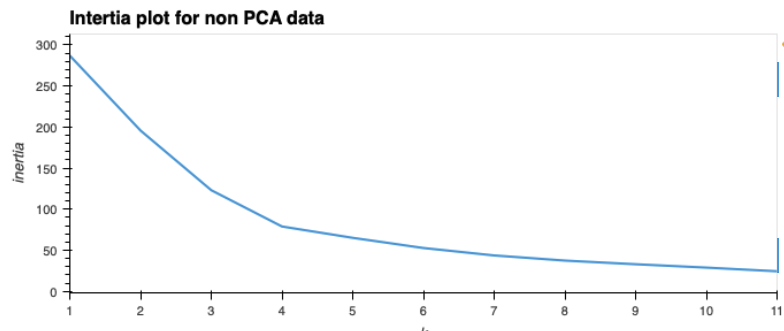
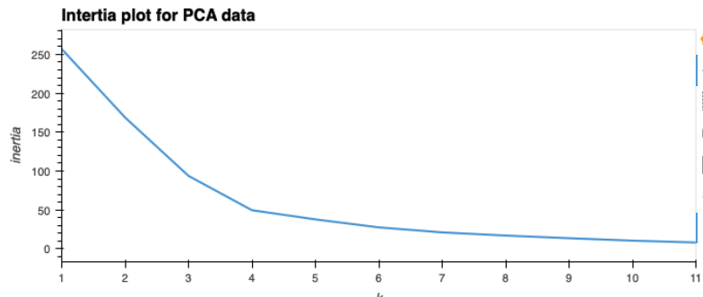
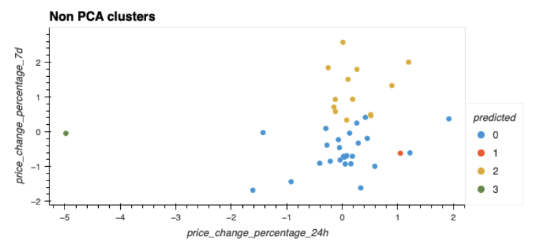
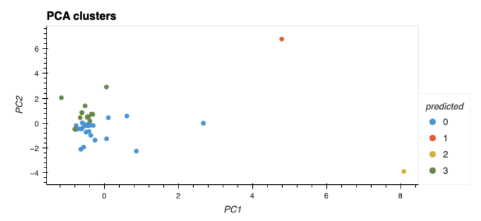

# Crytpo Market Data Analysis Using KMeans

### Analysis

What’s the best value for k?

+ The best value of k is 4, this was found after we scaled our data and did not apply PCA

What’s the best value for k when using the PCA data? Does it differ from the best value for k that you found by using the original data?

+ The best value of k when using PCA data is 4, this is the same k value found without as when we did not apply PCA.

Based on visually analyzing the cluster analysis results, what’s the impact of using fewer features to cluster the data by using K-means?

+ The impact made after using fewer features to cluster the data, we can see that the clusters have become tighter and have a better fit to the scaled data. 

### References
Data for this dataset was generated by edX Boot Camps LLC, and is intended for educational purposes only.
